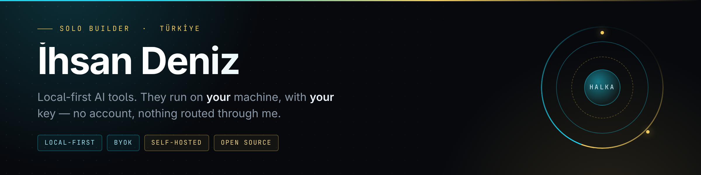

  

  

  <a href="https://ihsandeniz.net.tr"><b>ihsandeniz.net.tr</b></a>
  &nbsp;&nbsp;·&nbsp;&nbsp;
  <a href="https://x.com/idkgen0"><b>X / @idkgen0</b></a>
  &nbsp;&nbsp;·&nbsp;&nbsp;
  <a href="https://www.threads.net/@idkgen0"><b>Threads / @idkgen0</b></a>

 

## What I am building now

<table>
  <tr>
    <td valign="top">
      FLAGSHIP / IN ACTIVE DEVELOPMENT
      <h2><a href="https://ihsandeniz.net.tr/proje.html?p=alice">Alice AI — Yuki</a></h2>
      
<strong>A voice AI companion that lives on your machine, not on someone's server.</strong>

      

        Most AI companions are a browser tab in front of infrastructure you do not control:
        the conversations sit in someone else's database, the voice is rented, and the whole
        thing stops existing the day the service does.
      

      

        Yuki is a desktop app. Speech recognition runs on your own CPU (faster-whisper),
        long-term memory is a vector store on your own disk, and the model is whichever one you
        bring a key for — OpenRouter, OpenAI, Gemini, or a local Ollama. It ships with a large set of system
        tools: screen capture, files, shell, web search and browsing, clipboard, media and window
        control, notifications, memory search.
      

      

        Two faces: a classic chat window, and <strong>HALKA</strong> — a ring HUD that sits on the desktop.
      

      

        <strong>The free Lite build is out for Linux</strong> (AppImage, no installation).
        The paid tiers — persistent long-term memory and offline licensing — are built;
        the commercial launch is still pending.
      

      

        <a href="https://ihsandeniz.net.tr/proje.html?p=alice"><b>project page</b></a>
        &nbsp;&nbsp;·&nbsp;&nbsp;
        <a href="https://github.com/ihsandeniz/yuki-ai/releases/latest"><b>download Yuki Lite</b></a>
      

    </td>
  </tr>
</table>

 

<table>
  <tr>
    <td width="66%" valign="middle">
      <h2>One person. No company, no team.</h2>
      

        Architecture, code, design, docs, deployment — all of it is me. I ship in public and I try
        not to announce anything I have not actually run. Where a project is unfinished, the README
        says so.
      

      

        The common thread across everything here: <strong>it runs on hardware you own.</strong>
        No account to create, no telemetry, and no service of mine sitting between you and your
        own data. You bring the key; the files stay where they are.
      

      

        <code>PYTHON</code>&nbsp;
        <code>FASTAPI</code>&nbsp;
        <code>TYPESCRIPT</code>&nbsp;
        <code>VANILLA&nbsp;JS</code>&nbsp;
        <code>POSTGRES · PGVECTOR</code>&nbsp;
        <code>ARCH&nbsp;LINUX</code>
      

    </td>
    <td width="34%" align="center" valign="middle">
      
       
      <b>HALKA</b> · the ring
    </td>
  </tr>
</table>

 

## Open source

> Every one of these is a tool I use myself. Self-hosted, bring-your-own-key, no cloud account.

| Project | What it is |
| --- | --- |
| **[usage&#8209;tracker](https://github.com/ihsandeniz/usage-tracker)**   Python · MIT | A *Pane for Linux*: all your AI usage, rate limits and real dollar spend in one place — a waybar badge, a floating widget, or a web panel. Guided setup that shows you every line before it writes it, and undoes it from the same screen. stdlib Python + Vanilla JS, zero dependencies, loopback-only. |
| **[galleryweb](https://github.com/ihsandeniz/galleryweb)**   Python · AGPL-3.0 | A self-hostable photo & video gallery with a real editing studio — crop, rotate, filters, colour and light adjustment, video trimming. No login, no cloud account: double-click and it runs. FastAPI + Vanilla JS. |
| **[uai&#8209;agents](https://github.com/ihsandeniz/uai-agents)**   TypeScript · MIT | A six-agent autonomous orchestration system you run on your own server. A router analyses each task, hands it to the right specialist, and a QA agent checks the result; past runs are embedded into pgvector so routing improves over time. In-process event bus, no external queue. |
| **[yuki&#8209;ai](https://github.com/ihsandeniz/yuki-ai)** | Release channel for the free Yuki Lite build — a single AppImage, nothing to install. |

 

  

  Header art generated from <a href="./build">./build</a> — plain HTML, rendered locally. No external services.

